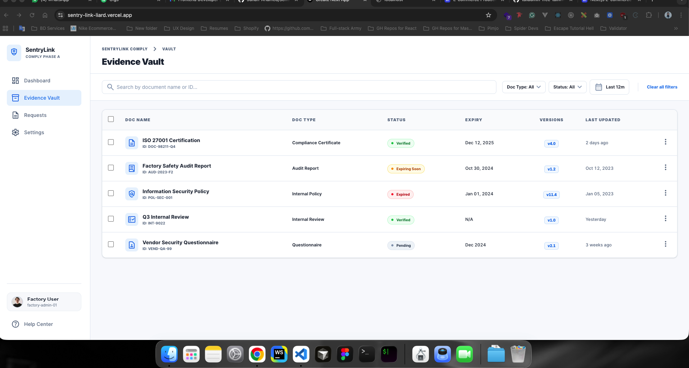
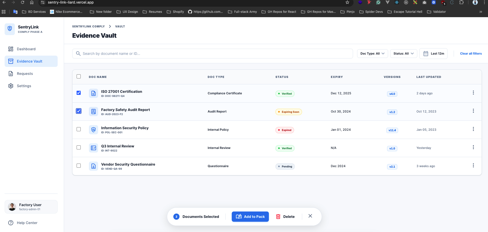
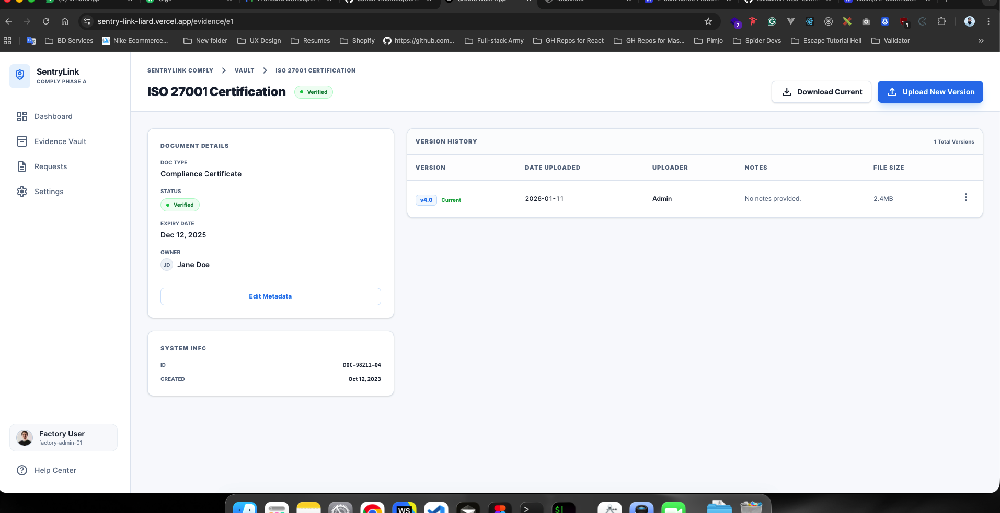
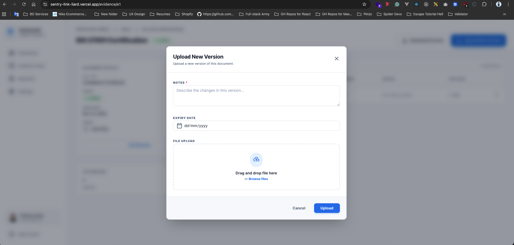
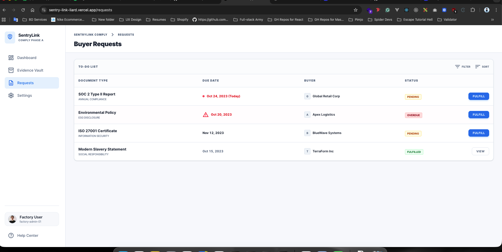
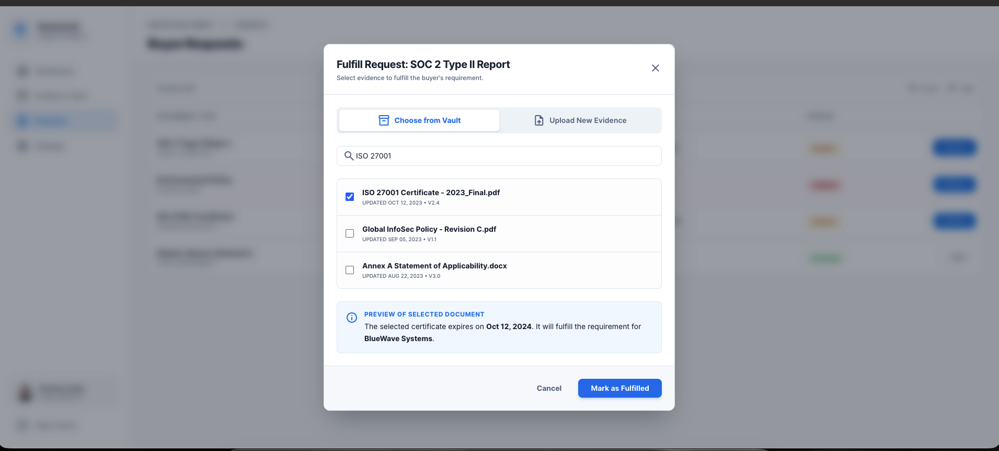

# SentryLink Comply - Phase A (Factory User UI)

A high-fidelity React/Next.js implementation of the SentryLink Comply dashboard. This UI allows Factory users to manage their Evidence Vault, track document versions, and fulfill Buyer requests.

## 📸 Project Previews

### 1. Evidence Vault (Screen A)
The central hub for managing documents with bulk actions and advanced filtering.






### 2. Document Details & Versioning (Screen B)
Detailed metadata view with a full version history and upload capability.





### 3. Buyer Requests & Fulfillment (Screen C)
A to-do list for compliance tasks with an integrated vault fulfillment modal.





---

## ✨ Key Features Implemented

* **Screen A: Evidence Vault**
    * Full table with Doc Name, Type, Status, Expiry, and Versions.
    * Search and filter bar (Doc Type, Status, Expiry).
    * **Bulk Select:** Floating action bar appears when items are selected.
* **Screen B: Evidence Detail + Versions**
    * Metadata summary with status chips.
    * Version history table (Date, Uploader, Notes).
    * "Upload New Version" modal with required notes and file upload mock.
* **Screen C: Buyer Request To-Do**
    * List of request items with due dates (Overdue/Pending logic).
    * **Fulfill Action:** Modal allowing users to search the existing vault or mock a new upload.

## 🛠️ Technical Rules Followed

* **URL Persistence:** Filters and search queries persist in the URL query string (e.g., `?status=verified`).
* **Reusable Components:** * `StatusChip`: Dynamic colors for status states.
    * `DataTable`: Reusable across Vault and Version history.
    * `Modal`: Standardized layout for all pop-ups.
* **Local State:** Managed via React hooks with mocked JSON data.

## 📦 Run Locally

1. **Install Dependencies:**
   ```bash
   npm install


This is a [Next.js](https://nextjs.org) project bootstrapped with [`create-next-app`](https://nextjs.org/docs/app/api-reference/cli/create-next-app).

## Getting Started

First, run the development server:

```bash
npm run dev
# or
yarn dev
# or
pnpm dev
# or
bun dev
```

Open [http://localhost:3000](http://localhost:3000) with your browser to see the result.

You can start editing the page by modifying `app/page.tsx`. The page auto-updates as you edit the file.

This project uses [`next/font`](https://nextjs.org/docs/app/building-your-application/optimizing/fonts) to automatically optimize and load [Geist](https://vercel.com/font), a new font family for Vercel.

## Learn More

To learn more about Next.js, take a look at the following resources:

- [Next.js Documentation](https://nextjs.org/docs) - learn about Next.js features and API.
- [Learn Next.js](https://nextjs.org/learn) - an interactive Next.js tutorial.

You can check out [the Next.js GitHub repository](https://github.com/vercel/next.js) - your feedback and contributions are welcome!

## Deploy on Vercel

The easiest way to deploy your Next.js app is to use the [Vercel Platform](https://vercel.com/new?utm_medium=default-template&filter=next.js&utm_source=create-next-app&utm_campaign=create-next-app-readme) from the creators of Next.js.

Check out our [Next.js deployment documentation](https://nextjs.org/docs/app/building-your-application/deploying) for more details.
